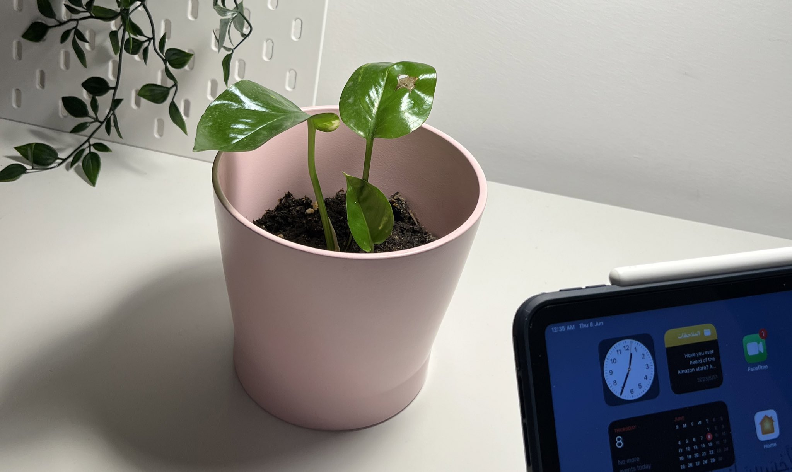

# GitHub Pages Setup Guide

## المشكلة الحالية
- الصور لا تظهر بشكل صحيح على GitHub Pages
- التنسيق يظهر بشكل مشوه
- الروابط الخارجية لا تعمل بشكل موثوق

## الحل المقترح

### 1. إنشاء مجلد الصور
```
pothos-gallery/
├── images/
│   ├── 1-two-leaves.jpg
│   ├── 2-fresh-leaves.jpg
│   ├── 3-quiet-growth.jpg
│   ├── 4-young-leaves.jpg
│   ├── 5-start-trailing.jpg
│   ├── 6-study-corner.jpg
│   ├── 7-lush-growth.jpg
│   ├── 8-full-bloom.jpg
│   ├── 9-elegant-trailing.jpg
│   ├── 10-stretching-journey.jpg
│   ├── 11-long-to-floor.jpg
│   └── 12-peak-growth.jpg
└── index.html
```

### 2. تحديث روابط الصور في HTML
بدلاً من:
```html

```

استخدم:
```html

```

### 3. خطوات التنفيذ
1. قم بتنزيل جميع الصور من Imgur
2. ضعها في مجلد `images/`
3. غيّر روابط الصور في index.html
4. ارفع المجلد بالكامل إلى GitHub

### 4. ملاحظات هامة
- تأكد من أن أسماء الصور لا تحتوي على مسافات أو رموز خاصة
- استخدم روابط نسبية دائماً (`./images/`)
- اختبر الموقع محليًا قبل رفعه

## الروابط الحالية التي تحتاج إلى تحديث
- https://i.imgur.com/pohewvjh.jpg → ./images/1-two-leaves.jpg
- https://i.imgur.com/0r1simZh.jpg → ./images/2-fresh-leaves.jpg
- https://i.imgur.com/Wyl1qBwh.jpg → ./images/3-quiet-growth.jpg
- وهكذا لجميع الصور
